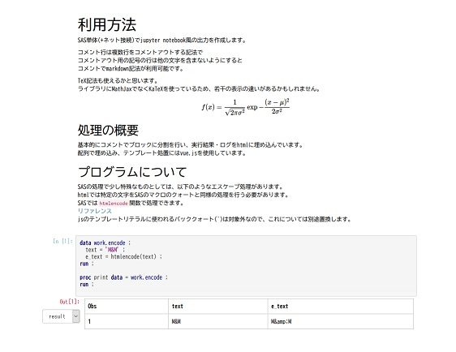

# SASNB Notebook Style Output

SAS単体(+ネット接続)でjupyter notebook風の出力を作成します。

コメント行は複数行をコメントアウトする記法でコメントアウト用の記号の行は他の文字を含まないようにすると
コメントでmarkdown記法が利用可能です。  
TeX記法も使えるかと思います。

プログラム例
```sas
/*
markdown記法が有効
*/ 

proc print data = sashelp.class ;
run ;

```

マクロ呼び出し  
```sas
%sasnb(prg = sample.sas , 
       out = sample.html,
  template = nb_template.html
)  ;
```

testフォルダにサンプルのコードや出力例もあるのであわせて見てみてください。
テスト用のコードのエンコーディングはutf-8です。    
セッションエンコーディングとプログラムのエンコーディングが違う場合、パラメータで`enode=utf-8`のように指定すれば文字化けせずに出力できます。
